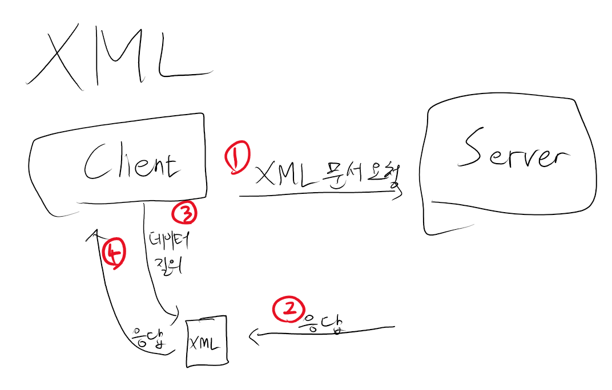
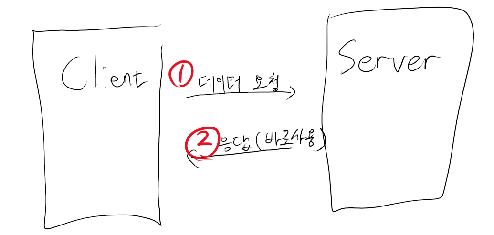
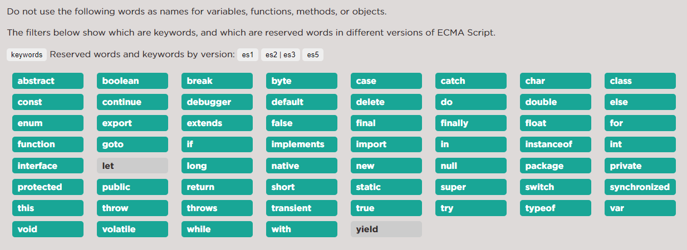
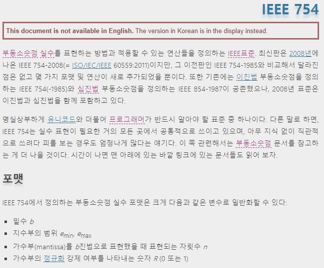

# JSON


> 데이터 페이로드 포맷에서 XML이 주류가 된 것은 XML이 훌륭해서가 아니라 널리 채택되었기 때문입니다. JSON 이나 YAML 은 기술적으로 얼마나 훌륭한지 설명하는 데만 집중하고 있습니다. 어떤 멍청한 툴이라도 XML 보다는 더 나은 데이터 포맷을 생성할 수 있을 것입니다.   
>  ー 제임스 클라크

## 2000년대 초의 상황

2000년대 초, 소프트웨어 산업은 XML에 지배당하고 있었다. 마이크로소프트, IBM, 오라클 그외 거대 기업들이 전부 XML을 토대로 차세대 소프트웨어를 만들겠다고 선언했다.

## XML은?



서버에 쿼리를 보내면 XML 문서로 응답하는 방식이다. 여기서 응답받은 XML을 바로 사용할 수 없고 이 문서에 추가 질의하여 필요한 데이터를 얻어야 한다.

필요한 데이터는 전혀 문서로 보이지 않는 간단한 것들임에도, XML 문서를 요청해야만 한다.



## 자바스크립트에서?

더글라스 크락포드와 칩 모닝스타는 비효율적인 XML을 대체하기 위한 데이터 포맷을 생각한다. 여기서 자바스크립트의 객체 리터럴을 사용하는 방법을 생각해 낸다. 자바스크립트 측면에서도 편리하고, 자바 측면에서도 데이터를 분석하는 게 어렵지 않다.

```javascript
var obj = {
  myKey1: 'myValue1',
  'my-key2': 'myValue2',
  1: 10,
  myKey1: 'myValue3',
};
```

키-밸류 형태로 접근할 수 있으며, XML 과 비교하면 정말 간단하다.

## 당시의 브라우저


참조 : [넷스케이프 내비게이터 VS 인터넷 익스플로러](http://www.ilovepc.co.kr/news/articleView.html?idxno=9020)

당시 마이크로소프트의 인터넷 익스플러러와 넷스케이프 네비게이터가 있었다. 각 회사가 자신들의 기능을 따로 개발했기 때문에 서버와 통신하는 기능에서는 둘의 공통점이 없었다.

두 브라우저 모두 자바스크립트(ES3)와 프레임셋을 가지고 있었다. 이를 사용하여 JSON 통신 채널을 만들었다.

## 최초의 JSON 메시지

```HTML
<html><head><script>
    document.domain = "fudco.com";
    praent.session.receive({to: "session", do: "test", text: "Hello world"});
</script></head></html>
```

하지만 ES3 의 예약어 정책 때문에 실패한다.



첫 JSON은 do 라는 이름의 속성 때문에 구문 오류가 발생하게 된다.

이 문제는 ES5 에서는 속성 이름에 예약어를 사용하지 못한다는 제약이 없어져 해결되었지만, 당시 따옴포("") 로 둘러싸서 문제를 해결했다.

또한 </ 문자를 포함한 문자열이 문제를 일으킨다는 것도 발견했다. 여기서는 이스케이프 문자를 써서 해결했다. <\\>

이 시절에는 JSML 이라고 불렀으나, 다른데서 쓰는 이름이라 JSON 으로 바꾸게 된다.

JSON은 자바와 자바스크립트 사이의 통신에서도 잘 작동한다.

## 표준화

당시 고객들은 XML을 사용하고 있어, JSON은 필요 없다고 말한다. 게다가 표준이 아니라 쓸 수 없다고 한다. 따라서 제작자가 표준을 만들기 시작한다.

우선 json.org 도메인을 사고 JSON 의 형식을 맞추기 시작한다.

기본 철칙은 텍스트 형태를 유지하고, 최소한으로, 그리고 자바스크립트의 일부로 유지한다.

자바스크립트의 일부로 JSON을 유지한다는 철칙으로 쓸데없는 기능들은 집어넣지 않는다.

속성 이름은 따옴표로 둘러싸게 했다. 모든 이름을 따옴표로 둘러싸면 문제가 생기지 않는다.

## 주석?


JSON 에 표시할 수 있는 주석은 자바스크립트의 일부라는 철칙을 깨지 않아 추가했다.

하지만 파싱 명령어들을 주석에 넣고, 다른 언어들에서 JSON 코덱이 개발되면서, JSON 파서 개발 작업의 절반이 주석 처리라는 사실을 깨닫게 된다.

따라서 주석을 빼는 결정을 하게 된다.

## 다른 표준과의 독립성

JSON 은 매개체일 뿐 집행자가 아니다. 어떤 문자를 허용하고 허용하지 않을지는 데이터를 받는 쪽에서 결정해야 한다.



자바와 자바스크립트 모두 IEEE 754를 따르고 있지만, 다른 숫자 표현 방식을 가지는 다른 언어들도 사용이 가능하도록 만들었다.

infinity 와 NaN 은 데이터가 잘못되었다는 것을 뜻하기 때문에 뺀다. 잘못된 데이터는 전파해서는 안 된다.

null 은 포함을 시켰지만 null 에 의미를 두지는 않는다. 의미를 부여하는 것은 JSON 으로 통신을 하는 사용자들이다.

## JSON 이 동작할 수 있는 이유

각 언어별로 데이터 구조를 표한하는 방식이 서로 다르고 복잡할 수 있다. 그래서 JSON 을 설계할 때 공통점을 위주로 설계했다.

언어별로 숫자를 표현하는 방식은 제각각이지만, 모든 언어에서 10진수를 문자로 표현하는 방식을 사용할 수 있다.

언어별로 문자열이나 문자셋을 표한하는 방법이 다르다. UTF-16, UTF-32, UTF-8, EBCDIC...
여기서 JSON은 연속된 문자를 이용하여 표한하고, 각 언어에서는 이 문자열을 내부에서 사용 가능한 형태로 변환하여 사용한다.

언어별로 연속된 값을 표현할 수 있는 데이터 구조가 있다. 언어별로 다르겠지만, JSON 디코더 덕분에 대괄호 안에 쉼표로 구분된 값들로 표시할 수 있게 된다.

이처럼 모든 언어의 공통점을 찾으며 모든 프로그램이 서로 통신할 수 있게 만들었다.

## JSON 에 대하여

### 버전?

JSON 에는 버전이 없다. 1.0, 1.1, 1.2 ... 3.0...

단 하나의 표준 버전만 가지고 있기 때문에 버전 지옥에 빠지지 않으며 전체를 바꾸지 않고 JSON 을 바꿀 수 있는 방법은 없다. 이 점은 제작자가 굉장히 잘 한 일이라고 말한다.

### 호환성?

JSON 에 특정 기능을 추가하자는 제안을 받았다. 문제는 이후 서로 완전히 호환되지 않는 기능이 생긴다는 점이다.

실질적이고 가치가 있는 표준을 만들기 위해 이런 제안은 거절했다.

### 좋은 이름

프로그래밍에서 많은 비중을 차지하는 일은 이름을 짓는 것이다.

JSON(JavaScript Object Notation) 처럼 짓지 않았으면 한다.

이름때문에 JavaScript 에서만 사용할 수 있는 것이라고 생각되기도 한다. 이것은 자바와 자바스크립트는 어떤 연관이 있는가 라는 문제와 비슷하다.

O 는 Object(객체) 다. 자바스크립트에서의 객체는 이름:값 쌍의 집합이지만 다른 언어에서는 깨지기 쉬운 계층 클래스의 인스턴스다. 이 관점에서 JSON 은 객체 직렬화 형식이지만, JSON은 사실 데이터 직렬화 형식이다.

N 은 Notation(표기법) 이다. 데이터 형식을 '표기법' 으로 부르는 것은 잘못됫다고 생각한다.
